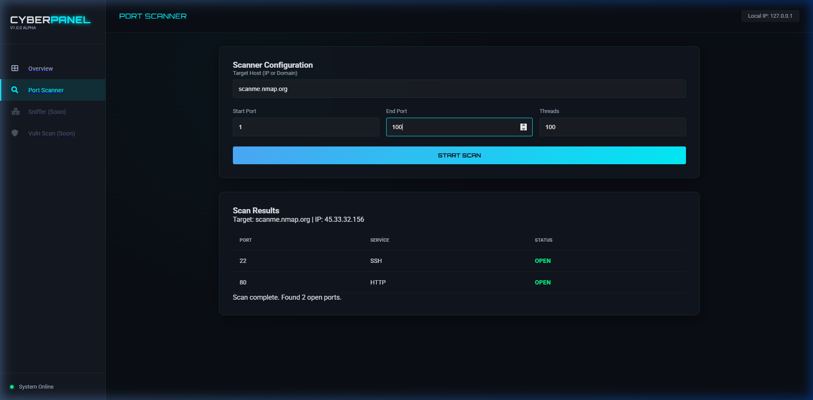

# 🛡️ CyberSec Monorepo & CyberPanel

Siber güvenlik alanında geliştirdiğim araçları ve bu araçları yöneten merkezi **CyberPanel** dashboard'unu barındıran profesyonel bir monorepo.




---

## 🖥️ CyberPanel Dashboard

**CyberPanel**, siber güvenlik araçlarını tek bir merkezden yönetmek için tasarlanmış modern bir Web UI platformudur. Terminal araçlarının gücünü, şık bir kullanıcı arayüzü ile birleştirir.

- **Merkezi Yönetim:** Port scanner, sniffer ve diğer tüm araçlara tek tıkla erişim.
- **Modern UI:** Yan menü (Sidebar), gerçek zamanlı istatistikler ve Cyberpunk teması.
- **Canlı Veri:** Tarama ve analiz sonuçlarının anlık olarak görselleştirilmesi.

---

## 📂 Proje Yapısı ve Durum

| Araç | Açıklama | Durum |
| :--- | :--- | :--- |
| **CyberPanel** | Merkezi Yönetim Paneli (Web UI) | ✅ Tamamlandı |
| **Port Scanner** | Çok thread'li, hızlı port tespiti | ✅ Tamamlandı |
| **Network Sniffer** | Trafik analizi ve paket yakalama | ⏳ Beklemede |
| **Vuln Scanner** | Temel zafiyet tarama otomasyonu | ⏳ Beklemede |

### Klasörler:
- `cyber-panel/`: Flask tabanlı merkezi yönetim arayüzü ve API.
- `port-scanner/`: Bağımsız terminal tabanlı port tarama betiği.

---

## 🚀 Başlangıç

Bu depoyu klonladıktan sonra CyberPanel'i başlatmak için:

```bash
cd cyber-panel
pip install flask
python app.py
```

Ardından tarayıcınızdan `http://127.0.0.1:5000` adresine giderek kontrol merkezine giriş yapabilirsiniz.

---

## 🛠️ Kullanılan Teknolojiler

- **Backend:** Python (Socket, Threading, Flask API)
- **Frontend:** HTML5, CSS3 (Glassmorphism), JavaScript (SPA Architecture)
- **Görselleştirme:** FontAwesome, Google Fonts, Custom CSS Animations

---
👨‍💻 Geliştirici: [mehmeteminyilmaz](https://github.com/mehmeteminyilmaz)
