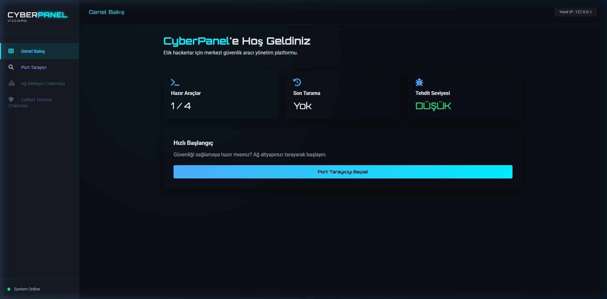
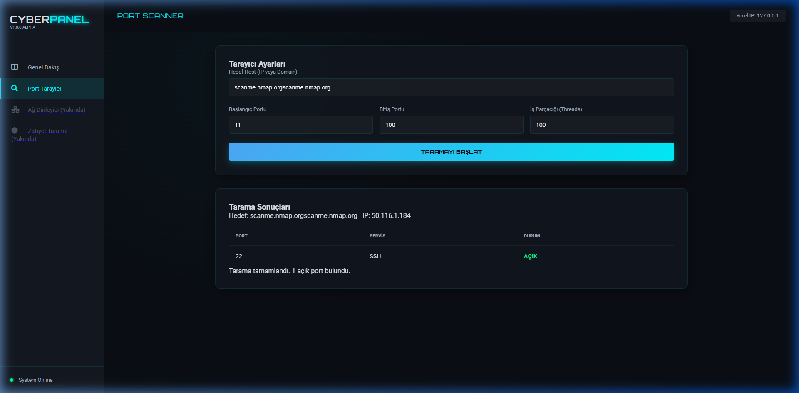

# 🛡️ CyberScan: CyberPanel Merkezi Güvenlik Paneli

Modern, hızlı ve görselleştirilmiş merkezi güvenlik kontrol merkezi. Bu proje, tüm siber güvenlik araçlarınızı tek bir şık web arayüzünde birleştirir.



## ✨ Özellikler

- **Merkezi Yönetim:** Tüm siber güvenlik modüllerine (Port Tarayıcı, Sniffer vb.) tek tıkla erişim.
- **Modern Arayüz:** Cyberpunk temalı, karanlık mod, yan menü (sidebar) ve görsel animasyonlar.
- **Yüksek Performans:** Python `threading` ve Flask API ile hızlı veri işleme.
- **Canlı Geri Bildirim:** Tarama sonuçları sayfa yenilenmeden anlık olarak tabloda listelenir.

## 🛠️ Teknolojiler

- **Backend:** Python, Flask (API)
- **Frontend:** HTML5, CSS3 (Glassmorphism), JavaScript (Fetch API)
- **Güvenlik:** Socket programlama, Multi-threading

## 🚀 Kurulum ve Kullanım

1. **Bağımlılıkları Yükleyin:**
   ```bash
   pip install flask
   ```

2. **Uygulamayı Başlatın:**
   ```bash
   python app.py
   ```

3. **Erişim:**
   Tarayıcınızdan `http://127.0.0.1:5000` adresine gidin.

## 📸 Ekran Görüntüsü (Port Tarayıcı Testi)

Aşağıdaki görsel, yeni Türkçe arayüz üzerinden yapılan başarılı bir port tarama testini göstermektedir. Sistem açık olan **Port 22 (SSH)** ve **Port 80 (HTTP)** servislerini başarıyla tespit etmiştir.



---
Geliştiren: [mehmeteminyilmaz](https://github.com/mehmeteminyilmaz)
