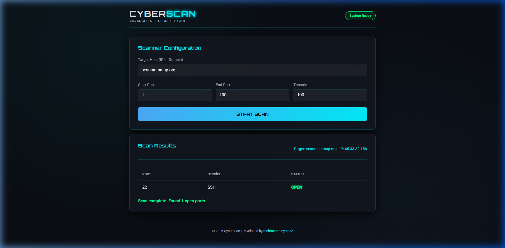

# 🛡️ CyberScan: Web Port Scanner Dashboard

Modern, hızlı ve görselleştirilmiş port tarama aracı. Bu proje, terminal tabanlı port tarayıcısını şık bir web arayüzüne taşır.



## ✨ Özellikler

- **Modern Arayüz:** Cyberpunk temalı, karanlık mod ve neon geçişli tasarım.
- **Yüksek Performans:** Python `threading` kütüphanesi ile aynı anda 100+ portu saniyeler içinde tarar.
- **Canlı Geri Bildirim:** Tarama sırasında görsel animasyonlar ve sonuç tablosu.
- **Servis Tanıma:** Yaygın portları (HTTP, SSH, FTP, MySQL vb.) otomatik olarak tanımlar.

## 🛠️ Teknolojiler

- **Backend:** Python, Flask
- **Frontend:** HTML5, CSS3 (Glassmorphism), JavaScript (Fetch API)
- **Güvenlik:** Socket programlama

## 🚀 Kurulum ve Kullanım

1. **Bağımlılıkları Yükleyin:**
   ```bash
   pip install flask
   ```

2. **Uygulamayı Başlatın:**
   ```bash
   python app.py
   ```

3. **Erişim:**
   Tarayıcınızdan `http://127.0.0.1:5000` adresine gidin.

## 📸 Ekran Görüntüsü (Test Sonucu)

Aşağıdaki görsel, `scanme.nmap.org` adresi üzerinde yapılan başarılı bir tarama testini göstermektedir. Sistem açık olan **Port 22 (SSH)** servisini doğru bir şekilde tespit etmiştir.


---
Geliştiren: [mehmeteminyilmaz](https://github.com/mehmeteminyilmaz)
